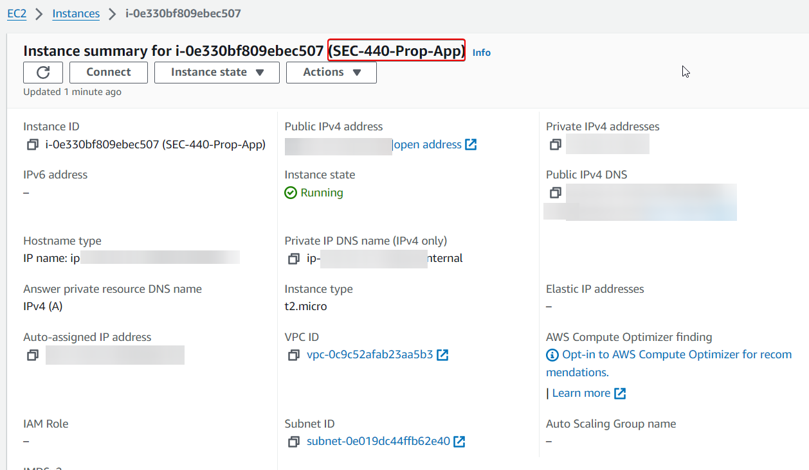
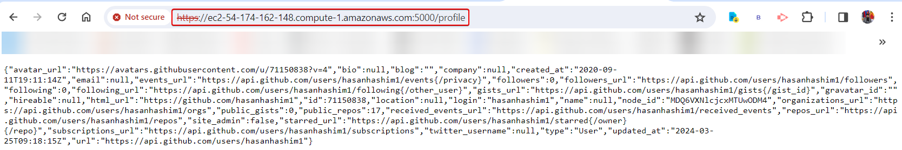

# SEC-440 Federated Identity Lab
**💡In this lab we are going to do a deep dive into how OAuth 2 actually works and we will implement some simple but effective github tradecraft procedures to keep sensitive data out of our source code repository.**


**Overview of Steps for the Lab**
* Step 1: Create an OAuth “test” app on Github
* Step 2: Configure a Flask webapp on xubuntu-wan that uses the Github OAuth “Test” app
* Step 3: Monitor the OAuth process using Firefox Developer mode
* Step 4: Create an OAuth “prod” app on Github
* Step 5: Clone and update the Flask app to an AWS EC2 instance - and configure to use the OAuth “Prod” app
* Step 6: Tech Journal and Reflection

### Step 1: Create an OAuth “test” app on Github

**OAuth Settings in Github**

To do that you need to go to **Settings** → **Developer Settings** → **OAuth Application**, click **register a new applicatiobn**, create an **OAUTH application**, and fille them out like it shown below:


### Step 2: Get your Test environment up and running.

The bloew commands is used to set up a Python development environment on Ubuntu or Debian-based Linux systems. The first command, `sudo apt install python3-pip build-essential libffi-dev python3-dev python3-setuptools libssl-dev`, installs essential packages for Python development, including `pip` for managing Python packages, `build-essential` for compiling software, libraries for Python and SSL development, and setuptools. The second command, `sudo apt install python3.10-venv`, installs the package necessary to create isolated Python environments using `venv`, which is particularly useful for managing dependencies on a per-project basis.

```
sudo apt install python3-pip build-essential libffi-dev python3-dev python3-setuptools libssl-dev
sudo apt install python3.10-venv
pip3 install virtualenvwrapper
```


Now we going to create a folder for our app:
```
mkdir oauthlab
cd oauthlab
```
and then we going to create a file called creds.json and add the follwoing:
```
{
    "client_id":"potato",
    "client_secret":"carrot",
    "authorization_base_url":"https://github.com/login/oauth/authorize",
    "token_url":"https://github.com/login/oauth/access_token"
}
```

Don't forgot to replace the following:

* **potato** with the client id from the oauth Test app
* **carrot** with the client secret generated from the oauth Test app


Now we going to create python file to add our app. In this case we going to use a code example which can be dound here: https://requests-oauthlib.readthedocs.io/en/latest/examples/real_world_example.html#real-example


Now we going to add the code below to the python file:

```
import json
fileObject = open("creds.json", "r")
jsoncontent = fileObject.read()
creds = json.loads(jsoncontent) 
```


and also add the line below to the last funcation:


The blow commands is used to create and activate a virtual environment for Python projects, followed by installing specific Python packages essential for web development and secure communication. The `python3 -m venv venv` command creates a virtual environment named `venv` to isolate project dependencies. Using `source venv/bin/activate`, the virtual environment is activated, changing the shell’s prompt to indicate that you’re now working inside `venv`. Once activated, `pip3 install wheel` ensures the latest `wheel` package is installed, which is a built-package format for Python. Following this, `pip3 install Flask` installs Flask, a micro web framework for building web applications. `pip3 install pyOpenSSL` adds OpenSSL’s SSL/TLS cryptography library to the environment, enhancing security. Finally, `pip3 install requests_oauthlib` installs the Requests-OAuthlib library, enabling OAuth1 and OAuth2 authentication for Python requests, which is useful for accessing web services securely.

```
python3 -m venv venv
source venv/bin/activate
pip3 install wheel
pip3 install Flask
pip3 install pyOpenSSL
pip3 install requests\_oauthlib
```


By running the below command it will run the python code (our app)


Now if you browse to https://127.0.0.1:5000/ you will see this which is a good sign. now login to it:


Click on Authorize:


### Step 3: Monitor the OAuth Process
Now you will see the JSON which is good, it means everything works correct:


Below are the Analysising to understand the process of what's going on:


ng](./Images/15.png)


### Step 4: Create OAuth “Prod App” for AWS EC2 Instance

Now we need to create a new Ubuntu 22.04 LTS instance on AWS using the AWS Academy Learner Lab. 



Create or edit the associated EC2 Security group such that tcp/5000 is allowed through


Now we going to do samething as did before and fill them out as shown below:
**THIS APP WILL BE DELETED SO DON'T EVEN TRY :)**


### Step 5: Port and Configure your Webapp to EC2
Now go to instance and click on **connect**, and click **connect** again


Move your files (python and the json) to the aws ubuntu use what ever way works for you. when you done run the command that run the commands on Step2:


Now edit the json file and add the line below to the end of the python file to open up port 5000, it should like the image below:


now run your python code by using the following command `python3 YOUR_FILE.py` 


Go to your public Ip of your ubuntu and if everything works then you should see this:


Here is the JSON which everything we did is correct:



### Reflection

I found it to be an incredibly enriching experience that offered a deep dive into the practicalities of web development, particularly in security and deployment. Learning to implement OAuth with GitHub and Flask not only solidified my understanding of federated identity management but also underscored the importance of maintaining security through best practices like environmental management and keeping sensitive data out of source code.


