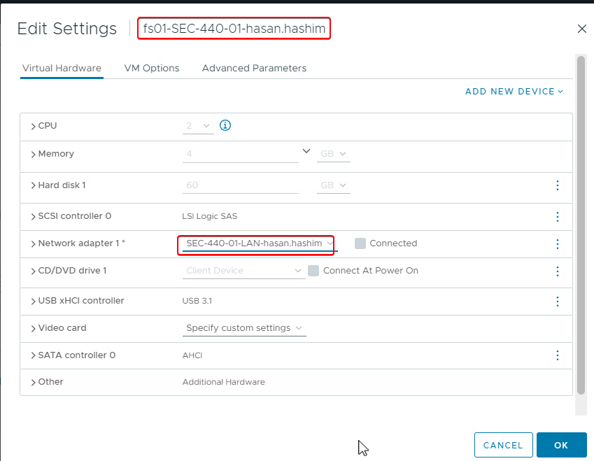
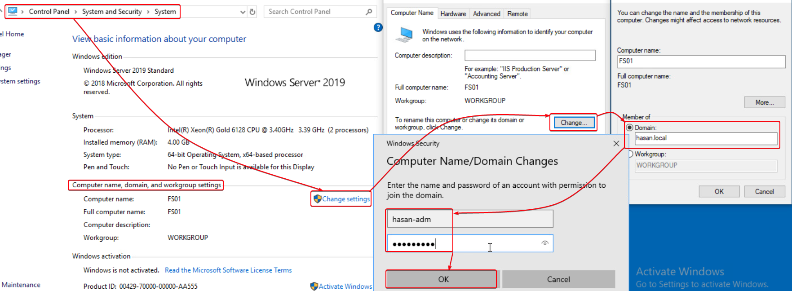
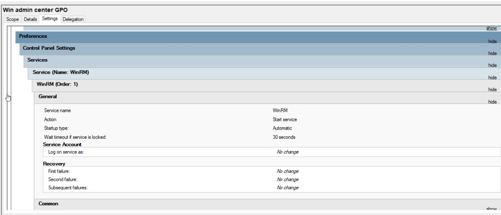

# Lab - Windows Admin Center

## Pre-Lab Configuration:
You have some new systems - please do the following:

### AD01
*   Make sure system is on your LAN Network
*   Before configuring Networking, use sconfig to turn updates to Manual
*   Set Timezone to be EST
*   Set the Hostname to be AD01
*   IP is 10.0.5.5/24
*   Install AD/DS, providing a domain of yourname.local
*   DHCP is a good idea (On your LAN only), you can either integrate that within AD or on one of your linux lan systems
*   Create a named Domain Admin and a named Domain User
### FS01
*   Make sure system is on your LAN Network
*   Before configuring Networking, use sconfig to turn updates to Manual
*   Set Timezone to be EST
*   Set the Hostname to be FS01
*   IP Address is 10.0.5.7
*   Joined to yourname.local
### WKS1
*   Make sure system is on your LAN Network
*   Joined to your domain
*   DHCP is a nice touch but not required\

## LAB - Windows Admin Center**
## AD01
First thing we need to do is to set the network for ad01 to our LAN:


Use powershell/admin to run the following commands:
```
sconfig
5
M
```
These command is to set the update manual:


Changing the hostname to `AD01`:


Set up the IP address and dns:
if you don't know how to do that use the following link:
https://arris.my.salesforce-sites.com/consumers/articles/General_FAQs/Windows-10-TCP-IP-Configuration


Install the AD/DS and create a domain, in my case the domain will be `hasan.local`:
If you don't know how to do it use the following link:
https://www.ibm.com/docs/en/storage-scale-bda?topic=support-install-configure-active-directory


DHCP is a good idea (On your LAN only), you can either integrate that within AD or on one of your linux lan systems


Create an admin user using the domain that you just created, in my case I create user called `hasan-adm@hasan.local`:


## FS01










