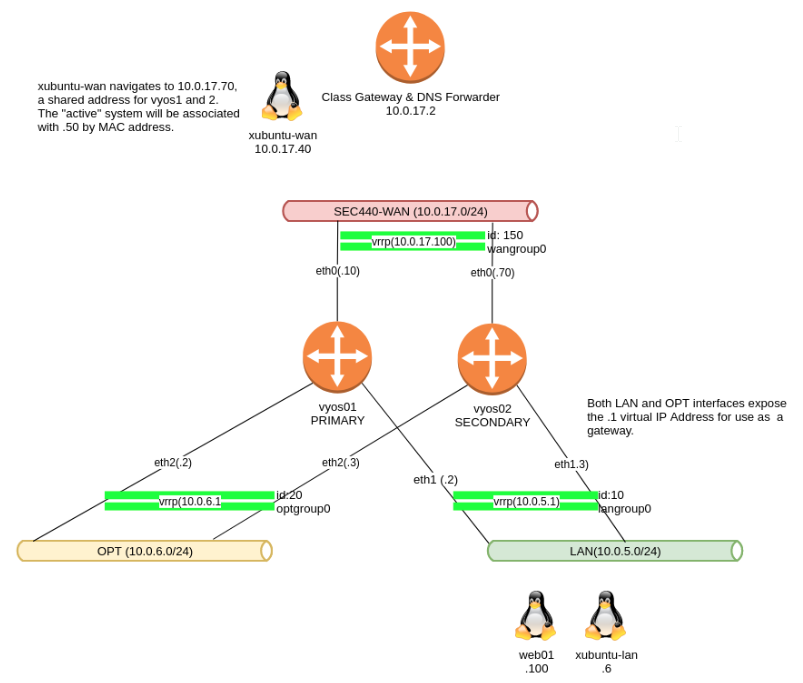

# Network Redundancy
It is not uncommon to double the amount of equipment when addressing network, service and host redundancy.  You will note that you have two vyos systems (vyos1 and vyos2).  There are several ways to achieve redundancy, but VRRP is typically the choice when using vyos.  You will also note that you have a new version of VYOS than previously exposed to.  Some of the commands have changed such as gateway configuration.\

You have at your disposal, a few IP's on the SEC440-WAN and access to that network.Your very own LAN and OPT networks to do what you wish.  Consult the  [Network Assignments](https://docs.google.com/spreadsheets/d/1LUMpmYONqyubdVlXP8V1MokGXdhnETNVgx-C9QFshJs/edit?usp=sharing) table for further details.

Here's a diagram showing hermione.granger's architecture for week 1. 
**NOTE- YOUR IP’s for WAN are different!!!**

# References
*   [Default Passwords for VMs](https://docs.google.com/document/d/1h97gchVRnHQyo4mL3GtkHYTuKJqeFtwbqCwcLnZ1Reo/edit?usp=sharing)
* <https://docs.vyos.io/en/latest/configuration/highavailability/index.html>
*   Possible Web01 note: If web01 does not have the correct password set, it is a great opportunity to learn to reset a CentOS7 Root Password!
   *   Follow the password reset instructions at: <https://www.tecmint.com/reset-forgotten-root-password-in-centos-7-rhel-7/>
    * Tip: Power on the VM in Vcenter and open the console
       *   Leave the console tab open and go back to the Vcenter tab
        *   Do an Actions -Power-Reset on Web01 and quickly click back to the Web01 console tab and press the ‘e’ key at the grub loader

# Requirements
Configure and Network the following systems.
*   vyos1
*   vyos2
*   xubuntu-wan
*   xubuntu-lan
*   web01*   Redundant WAN and LAN
   *   The WAN interface on vyos1 and vyos2 should be redundant so that addressing a single IP address will route to whichever vyos router is currently active.
   *   Your redundant WAN interface should be configured to port forward
        *   http to web01 on the LAN.
        *   ssh to web01 on the LAN, this should also be augmented with MFA and root SSH disabled.
* Your LAN based systems should also have a redundant default gateway of 10.0.5.1 where either of the two routers providing gateway services can be taken offline without an interruption in service.
*   No vyos firewall zones or rules are required for Project 1.

# Testing
*   From WAN, using arp, determine the real firewall host behind your virtual IP
*   From xubuntu-lan, determine active firewall using tracepath 10.0.17.2
*   Active WAN and LAN firewalls should be either vyos 1 or 2.
*   Kill the active firewall (it should be vyos1 or vyos2 for the active WAN/LAN connections
*   Port forwarding should work from WAN to a virtual IP that fronts a team of vyos firewalls ->Web01
   *   http (2 points)
    *   ssh (2 points)
       *   with MFA (1 point)
*   xubuntu-lan should still be able to route to the internet (3 points)
*   tracepath/traceroute from xubuntu-lan should show the first hop as the redundant firewall.

# Configurations and Testing Result
* vyos1 and vyos2
* xubuntu-wan and xubuntu-lan
* web01*   Redundant WAN and LAN
* Result