# vyos1 configuration
* Go to vcenter and click on the edit settings and add the netwrok adapter 2, as shown below:

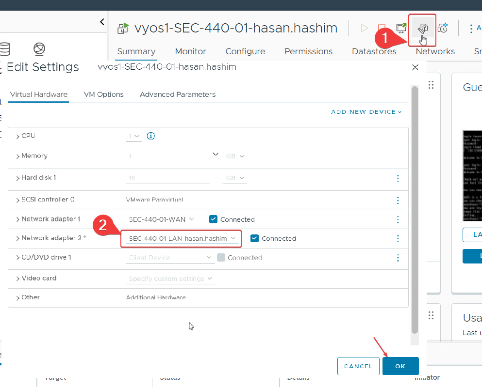

* Now we need to setup the hostname and the interfaces for eth0 and eth1. I used the following commands below to do that
```
config
set system host-name vyos1-HasanHashim
set interfaces ethernet eth0 address 10.0.17.15/24
set interfaces ethernet eth0 description "WAN"
set interfaces ethernet eth1 address 10.0.5.2/24
set interfaces ethernet eth1 description "LAN"

```
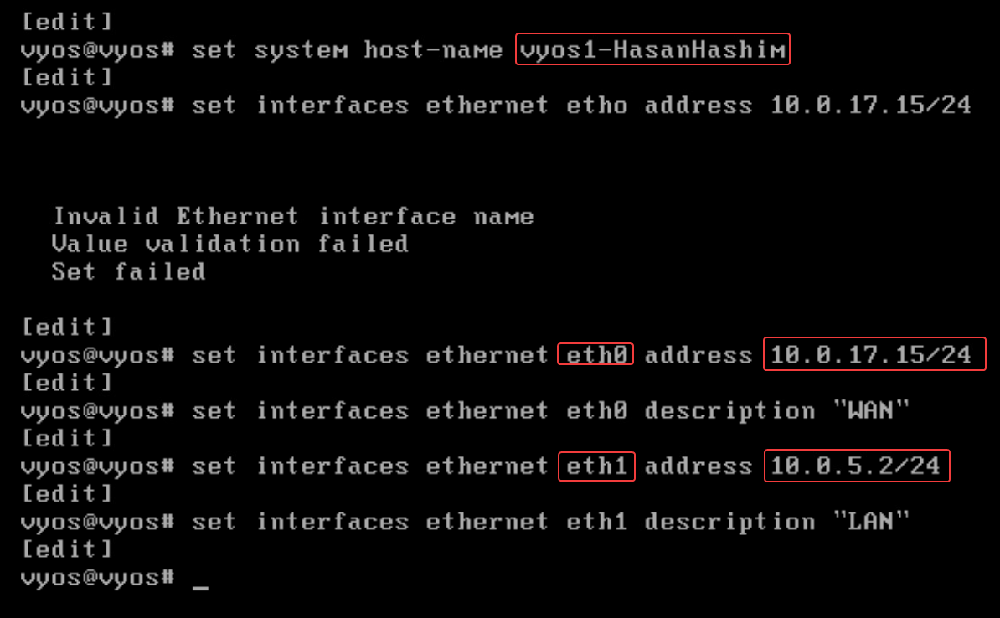

* We need to setup the default gateway and DNS server, as shown below:

  ```
  set protocols static route 0.0.0.0/0 next-hop 10.0.17.2
  set system name-server 10.0.17.2
  show interfaces  
  ```
  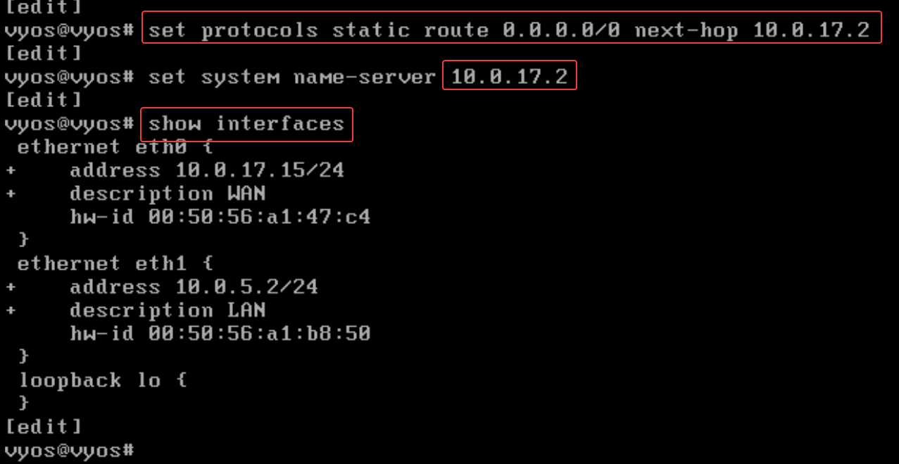
* NAT Rules
```
    set nat source rule 10 outbound-interface eth0
    set nat source rule 10 source address 10.0.5.0/24
    set nat source rule 10 description "Lan to Wan"
    set nat source rule 10 translation address masquerade
    commit
    save
    show nat source rule 10
```
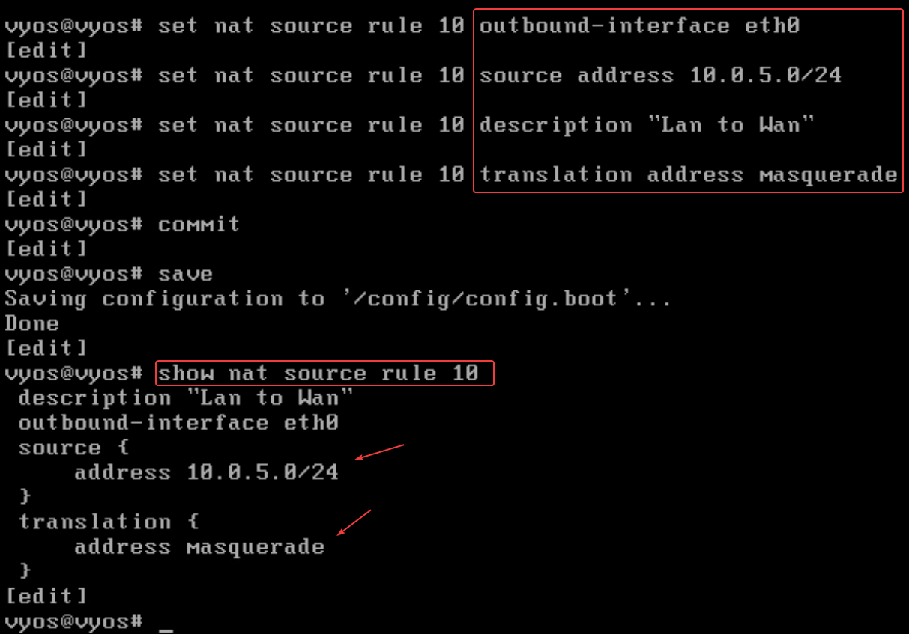
* DNS Forewarding
  ```
    set service dns forwarding listen-address 10.0.5.1
    set service dns forwarding allow-from 10.0.5.0/24
    set service dns forwarding system
    set service ssh listen address 0.0.0.0
    commit
    save
    show service
    ping google.com
  ```
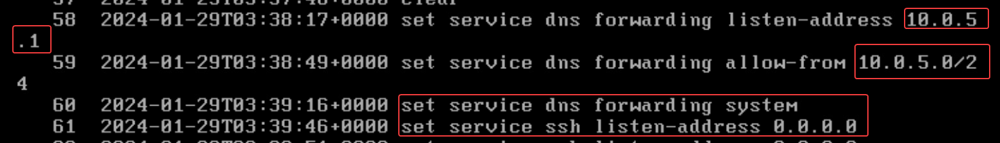
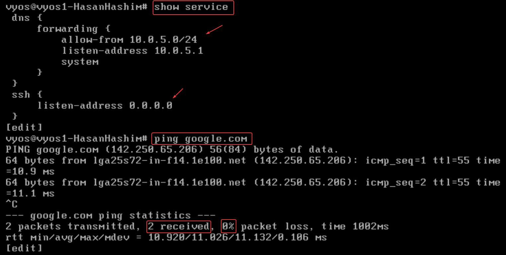
* taking a snapshot:
  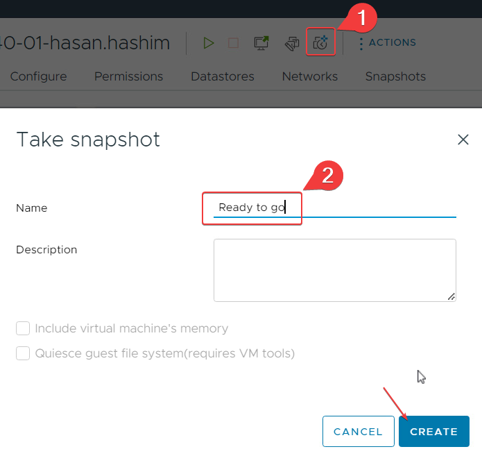
# vyos2 configuration 
* Go to edit settings and your LAN in the adapter 2, as shown below:

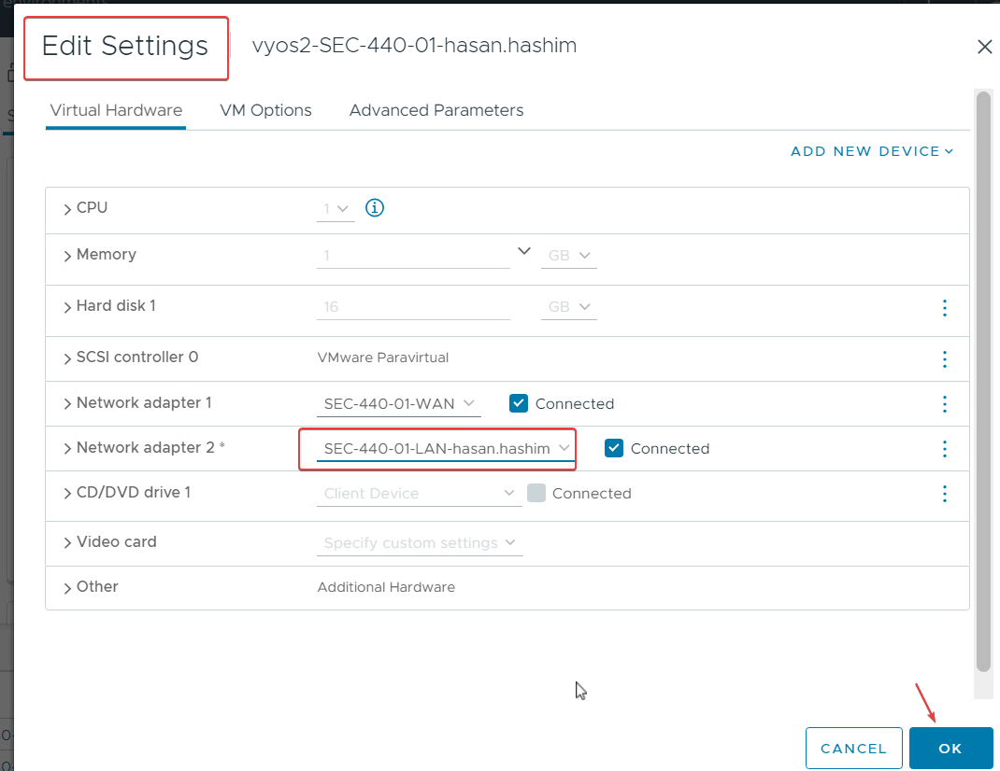

* Setting up the interfaces and defualt gatway and DNS
```
    set interfaces ethernet eth0 address 10.0.17.75/24
	set interfaces ethernet eth0 description "To WAN"
    set interfaces ethernet eth1 address 10.0.5.3/24
	set interfaces ethernet eth1 description "To LAN"
    
    set protocols static route 0.0.0.0/0 next-hop 10.0.17.2
    set system name-server 10.0.17.2
	commit
	save
```
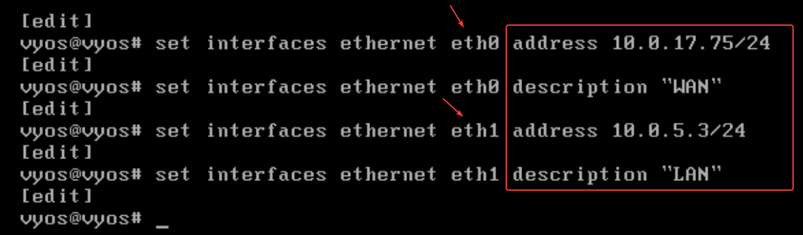
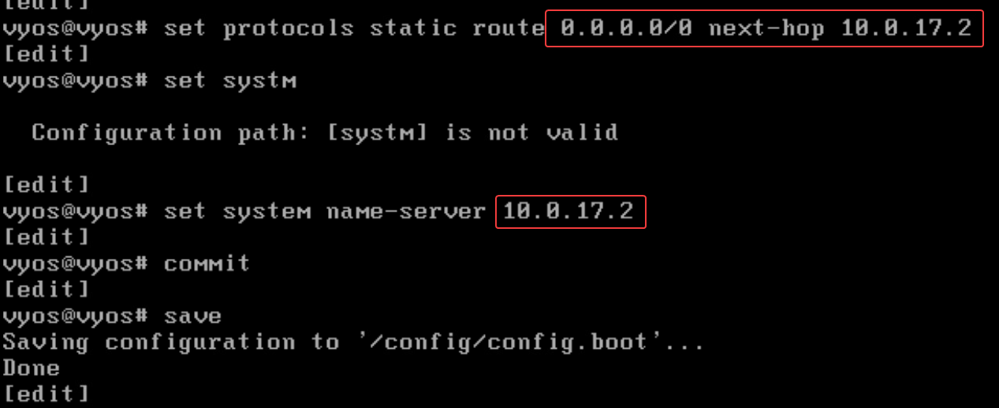
* NAT rules
```
    
    set nat source rule 10 source address 10.0.5.0/24
	set nat source rule 10 outbound-interface eth0
	set nat source rule 10 description "Lan to Wan"
    set nat source rule 10 translation address masquerade
	show nat source rule 10
    commit
    save
    
```
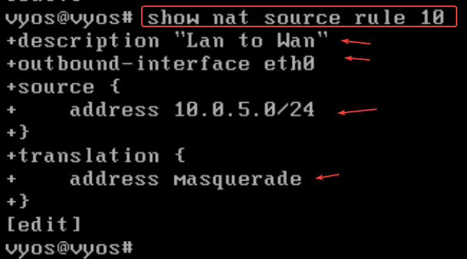

* DNS and SSH
  ```
    set service dns forwarding listen-address 10.0.5.1
    set service dns forwarding allow-from 10.0.5.0/24
    set service dns forwarding system
    set service ssh listen address 0.0.0.0
    ping hashimtech.com
  ```
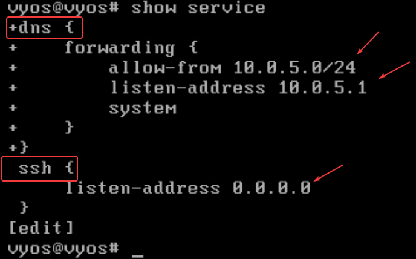
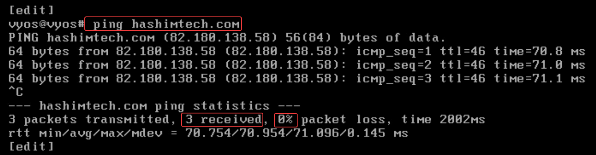

* poweroff and take a snapshot
  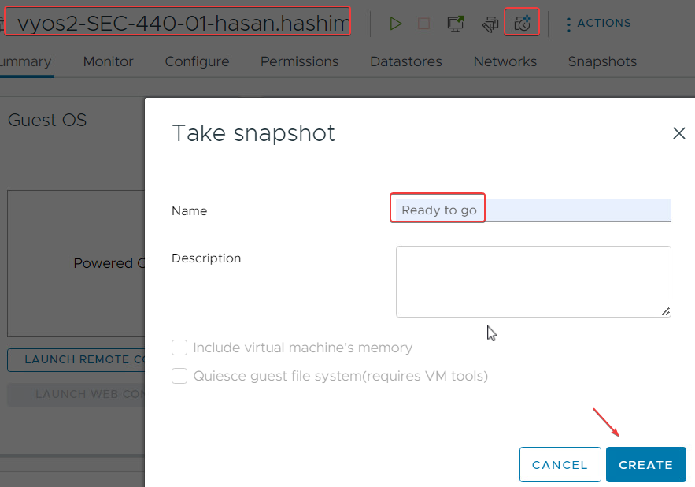


