# web01 configuration
* Befor you start add your Lan from the Edit Settings, as shown below:
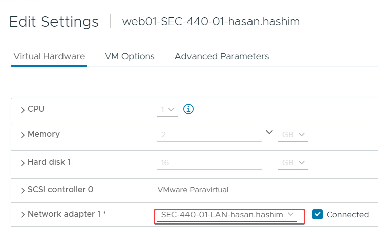
* Resting the Password:
  on power on click on "e", you will see something like that:
  
  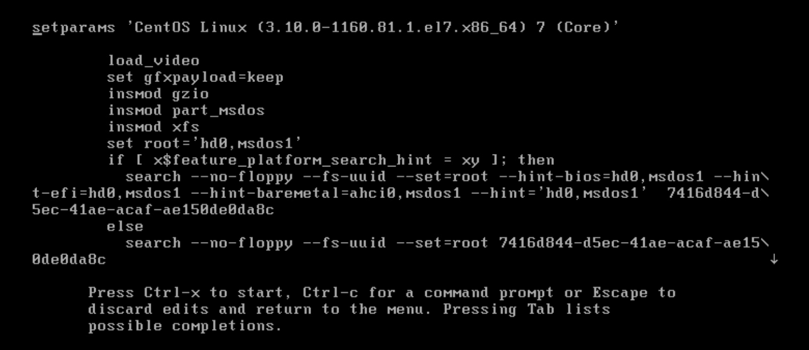

  Search for the following `rhgb quiet` and replace it with `init=/bin/bash` after that press `ctrl x`:
  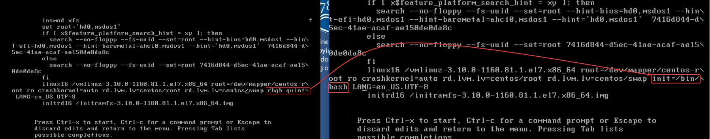

When you see a bash prompt, we need to get read-write permission to do that run the following command `mount -o remount,rw /` 

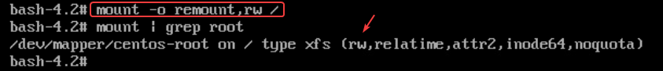

* Network configuration
  I added the following:
  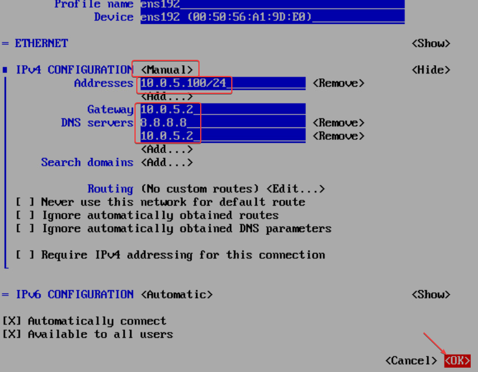
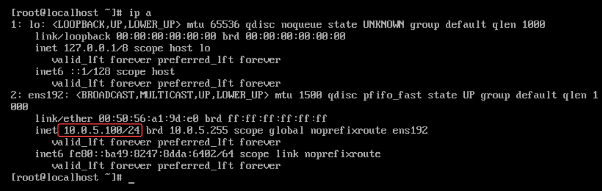
ping test:


Run the follwoing commands on both vyos1 and vyos2 for ports forwarding:
```
conf
set nat destination rule 10 description "WEB01 on WAN (HTTP)"
set nat destination rule 10 destination port 80
set nat destination rule 10 inbound-interface eth0
set nat destination rule 10 protocol tcp
set nat destination rule 10 translation address 10.0.5.100
set nat destination rule 10 translation port 80

set nat destination rule 20 description "WEB01 on WAN (SSH)"
set nat destination rule 20 destination port 22
set nat destination rule 20 inbound-interface eth0
set nat destination rule 20 protocol tcp
set nat destination rule 20 translation address 10.0.5.100
set nat destination rule 20 translation port 22


commit
save
show nat destination rule 10
show nat destination rule 20
```
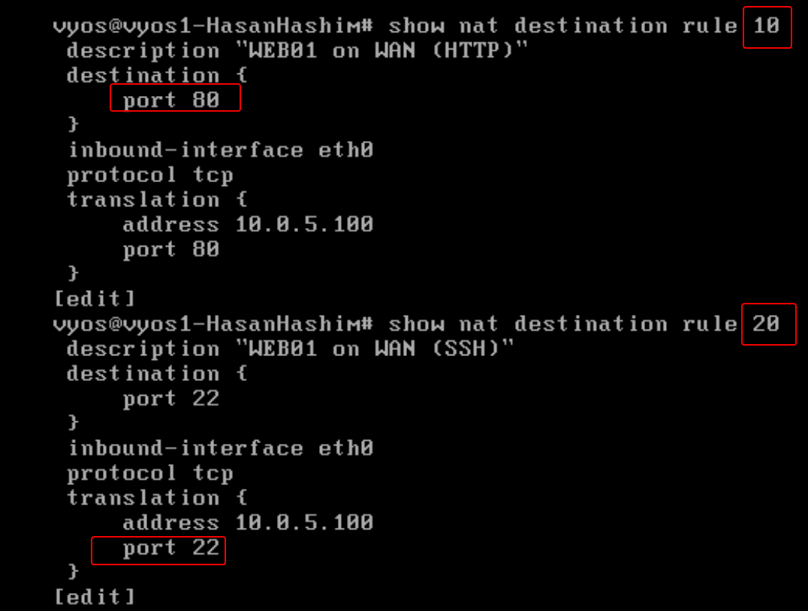
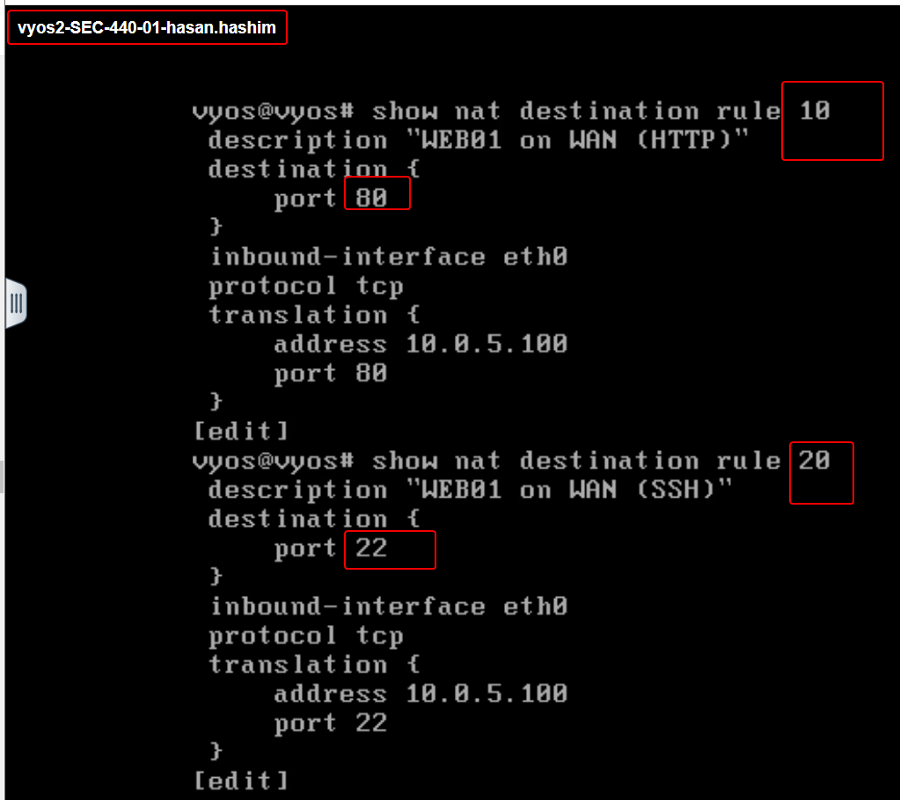

# Two-Factor Authentcation 

* Installing epel:
  ```
  sudo yum search epel
  sudo yum install epel-release
  sudo yum install google-authenticator qrencode-libs
  yum install google-authenticator
  google-authenticator
  ```
  and finsih up the rest of the steps:
  
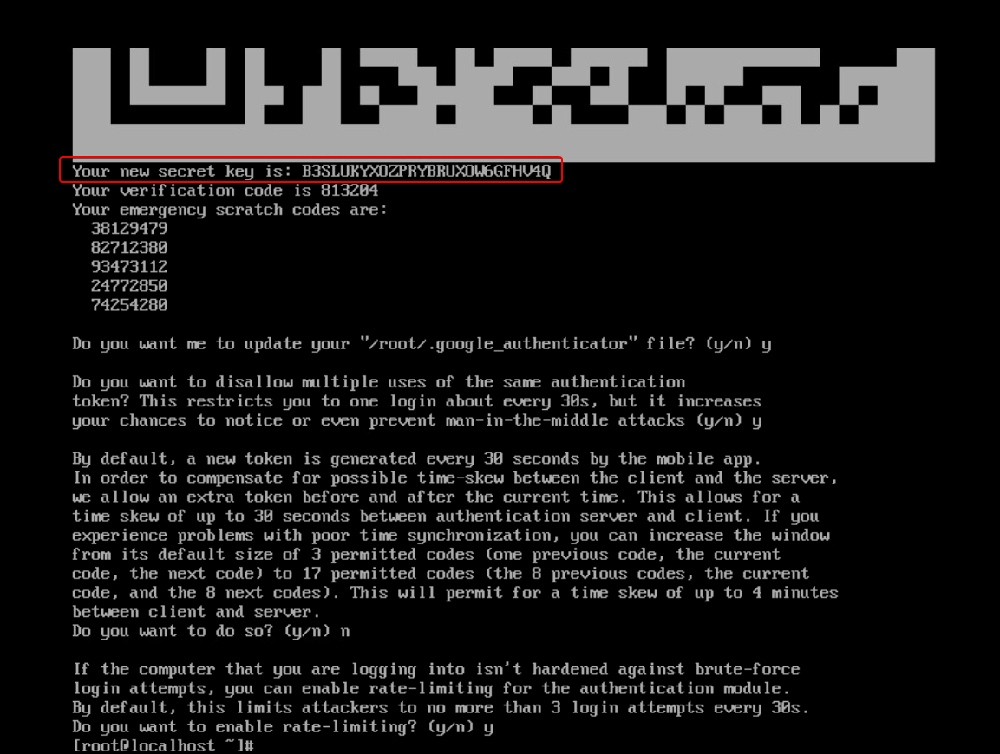

Openssh using MFA:
```
sudo cp /etc/pam.d/sshd /etc/pam.d/sshd.bak
sudo nano /etc/pam.d/sshd
```
Now we going to add the follwing lines in the end of the file:
```
auth       required     pam_google_authenticator.so
```
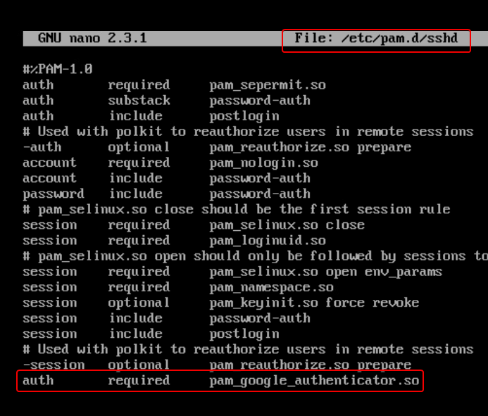

Now we have to change the challengeResponseAuthentication in the /etc/ssh/sshd_config no to yes, as shown below:

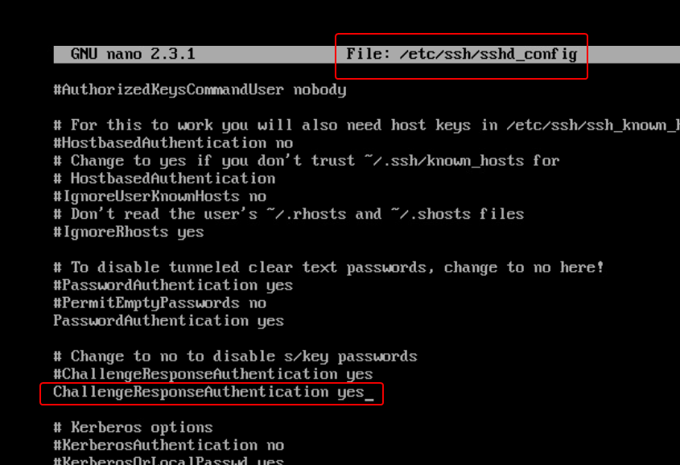

Testing:

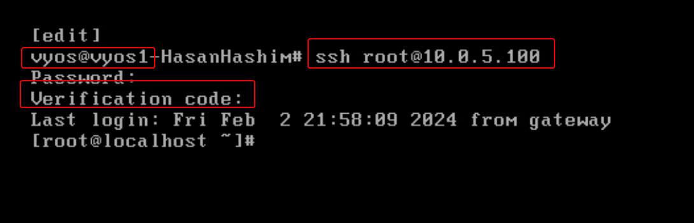


# Apache
I ran the following commands to update the system, isntalling httpd, starting the serice and setting up the firewall:
```
sudo yum update
yum install httpd
systemctl start httpd
systemctl enable httpd.service
firewall-cmd --add-service=http --permanent
firewall-cmd --reload
```
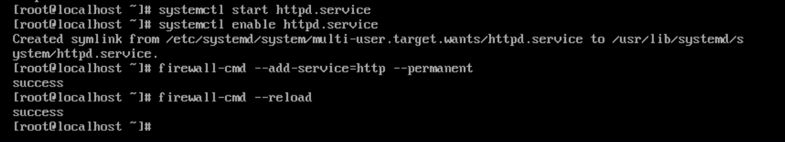


