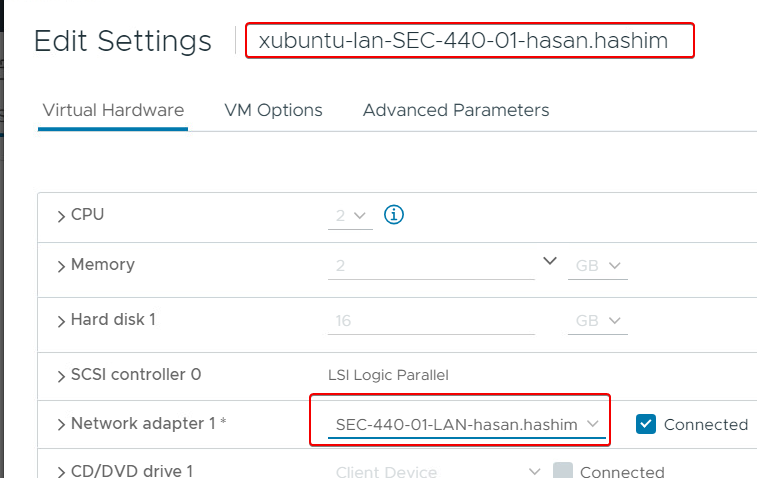
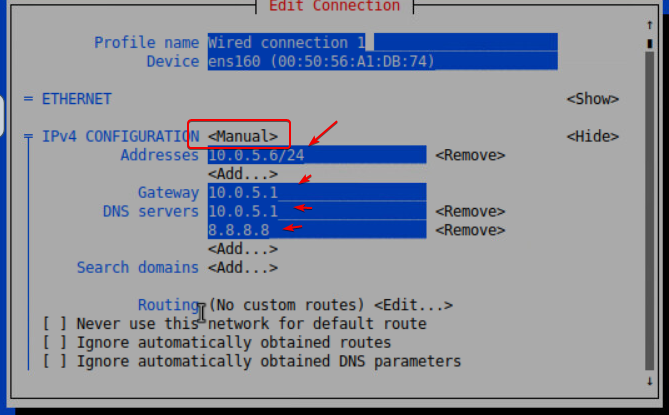
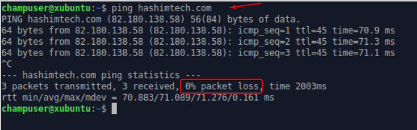
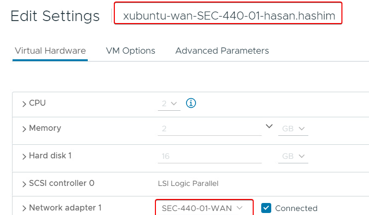
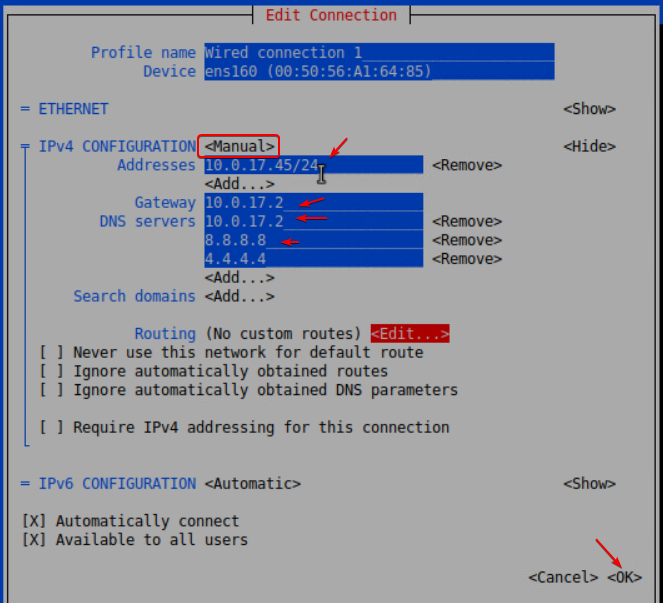
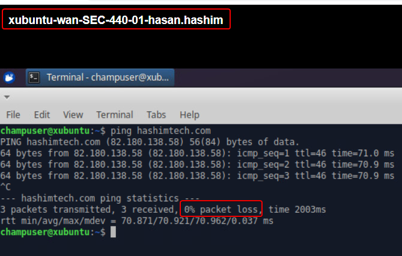

# xubuntu-lan
Don't foreget to change the network adapter to the your lan network:

Configuring the network:

Testing the network:

# xubuntu-WAN
Don't foreget to check the network adapter to the your WAN network, mine was fine as is:

Configuring the network:

Testing the network:

