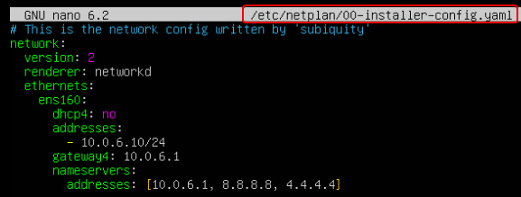

# Highly Available HAProxy Servers with Keepalived on Ubuntu

This guide outlines the process for establishing highly available HAProxy servers with Keepalived and reserved IPs on Ubuntu. It encompasses resources for deeper understanding, configurations for network settings, and automation scripts for both HAProxy servers' setup.

## Resources

Explore these resources for detailed insights and guides:

*   [DigitalOcean: Setup Highly Available HAProxy Servers with Keepalived](https://www.digitalocean.com/community/tutorials/how-to-set-up-highly-available-haproxy-servers-with-keepalived-and-reserved-ips-on-ubuntu-14-04)
*   [KubeSphere: HA Cluster Setup Using Keepalived & HAProxy](https://kubesphere.io/docs/v3.4/installing-on-linux/high-availability-configurations/set-up-ha-cluster-using-keepalived-haproxy/)
*   [Learn IT Guide: HA Cluster Configuration Using Keepalived](https://www.learnitguide.net/2021/11/configure-ha-cluster-using-keepalived.html)

## Network Adapter Configuration
* Begin by adding the network adapter to both HAProxy servers, illustrated in the following images:
  


## Network Setup for HA1 and HA2
Set IPv4, Gateway, and DNS for HA1 as depicted below:
```
sudo nano /etc/netplan/*.yaml
sudo netplan apply
```



### HA2 Network Configuration
* Configure HA2's network settings with a distinct IP address following the same steps:


## keepalived between ha1 and ha2
### Script Overview

For both HA1 (h1) and HA2 (h2), the script automates:

1.  System's package list update.
2.  HAProxy installation.
3.  Configuration appending to `/etc/haproxy/haproxy.cfg`.
4.  HAProxy service restart and enablement.
5.  Keepalived installation.
6.  Configuration appending to `/etc/keepalived/keepalived.conf`.
7.  Keepalived service restart and enablement.
8.  System reboot to apply changes.

### Configuration Insights

#### HAProxy Configuration

*   Manages incoming TCP connections on port 80, directing them across two backend servers (`10.0.5.100` and `10.0.5.101`) via round-robin balancing.
*   Implements health checks for backend servers' availability monitoring.

#### Keepalived Configuration

*   Establishes a VRRP instance for primary and secondary load balancers' failover management.
*   Monitors HAProxy, triggering failover to a secondary server upon HAProxy's failure.
*   Utilizes the virtual IP `10.0.6.10/24` for the VRRP instance.

### Customization Guide

*   Adapt IP addresses, interface names (`ens160`), and priorities within the Keepalived configuration to align with your network structure.
*   Tailor the HAProxy setup to reflect your backend servers' specific IP addresses and ports.

### Installation and Setup Procedure

1.  **Environment Preparation**: Verify server readiness and network connectivity.

2.  **Script Execution**: For HA1, designate the script as `h1.sh`, and for HA2, as `h2.sh`. Render the script executable and run it:
```
        bashCopy code
        chmod +x h1.sh
        ./h1.sh
        # Follow similar steps for h2.sh on the second server
```
### Troubleshooting Tips

*   **HAProxy Service Concerns**: Inspect HAProxy configuration syntax and verify port availability.
*   **Keepalived Role Adjustment**: Check network interface settings and ensure the virtual IP's exclusivity.

### Conclusion

These scripts streamline the establishment of a backup device within a high-availability load balancing framework utilizing HAProxy and Keepalived on Ubuntu. Modify the scripts as needed to accommodate your infrastructure specifics.

*   Access the HA1 script [here](h1.sh).
*   Access the HA2 script [here](h2.sh).


