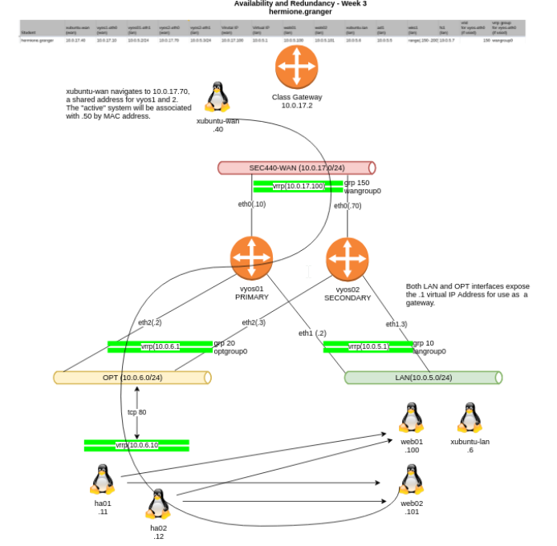

# SEC-440 Project 2 - Web and Proxy Redundancy

**You have at your disposal a second web server, web02 as well as two small ubuntu 22.04 server virtual machines.  If you haven't experienced the joys of netplan, here is your chance to join the fun!\
It is anticipated that any High availability solution would involve another system such as a load balancer.  Doing this exposes us to another single point of failure, so the two ubuntu systems have been provided so you can configure a redundant load balancer pair.  Hermione's plan below is an example.**\

## Requirements
*   Load balancers. Place on the OPT network with traffic routed to the appropriate web resource on the LAN.
*   *   HAproxy is the preferred choice - but you can choose something else if you prefer
    *   Remember - you will need to set up VRRP for OPT - as well as configure port forwarding rules for access from WAN to the load balancer(s)
*   web01 and web02 should have an index page that proclaims their hostname (example web01-hermoine, web02-hermione)
*   Web traffic from WAN should point to either web01 or web02.  If one of these servers goes down, the traffic should be routed to the other. 
*   *    (HINT: that is what the load balancers areused for!)
*   If one of your load balancers fails, service should not be interrupted but rather seamlessly move to the other load balancer
*   *   In other words, your load balancers should be a high availability pair.  The preferred way to do that is to implement VRRP directly on the HAProxy servers (Hint: The is what the Linux service “keepalived” does)**

## Projects plaing:

*   Setting up web02
    *   Install httpd
*   Adding a OPT network to vyos1, vyos2, ha1, ha2
*   VRRP for OPT
*   Configuring  ha1 and ha2
*   Changing the ip of port forwardingin vyos1, and vyos2
*   vrrp on ha1,2 proxies

## Projects testing

* On xubuntu-wan, curl your vyos virtual IP address.  This should take you to the active web server via a fully redundant link.
*   Bring down the active router
*   Repeat the curl test
*   Bring down the active web server
*   Repeat the curl test
*   Bring down the active proxy server
*   Repeat the curl test
  
## Configuration Documentation
1. [vyos1 and vyos2.md](./vyos1 and vyos2.md)
2. [web02.md](./web02.md)
3. [ha1 and ha2.md](./ha1 and ha2.md)