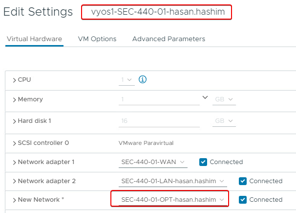
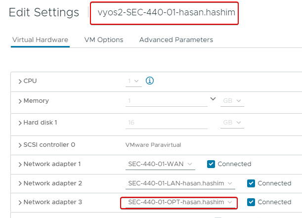
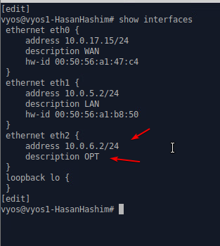
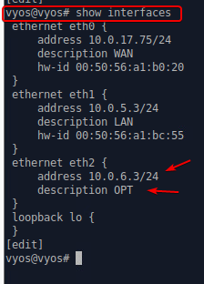
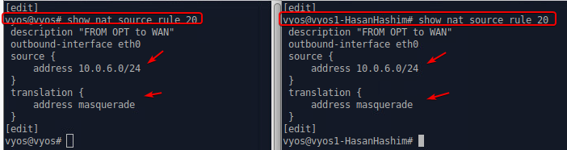
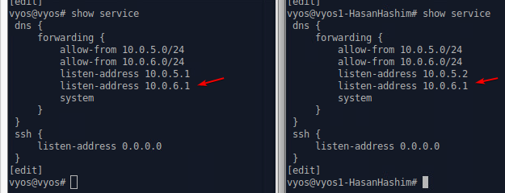
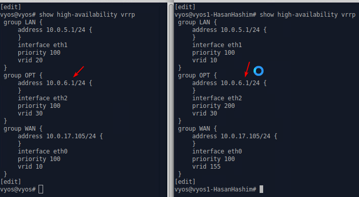
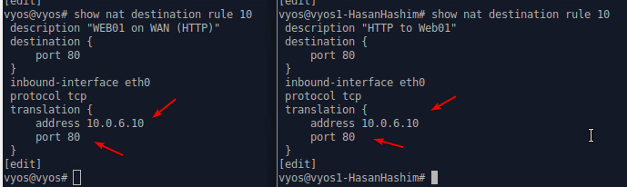

We have serveral configuration we have to go threw, that includes teh follwoing:
* Adding third network adapter for OPT (vyos1 and vyos 2)

*  Now we need to set the interfaces for the OPT in vyos 1 and 2
`show interfaces`

* adding nat source rule 20 (vyos 1 and vyos 2)
`show nat source rule 20`

* set up DNS in both vyos systems
`show service`

* Configure VRRP on both vyos 1 and vyos 2
`show high-availability vrrp`

**I created a script that does the above:**
Here is the script: [Web-and-Proxy-Redundancy.sh](./Web-and-Proxy-Redundancy.sh)

* After Configuring the Proxy then we should change the Nat (**port forwarding**) rule to this ip 10.0.6.10 on both vyos 1 and vyos 2
`set nat destination rule 10 translation address 10.0.6.10`
`show nat destination rule 10`

