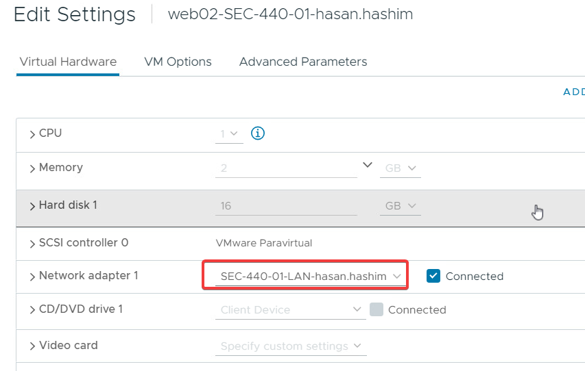
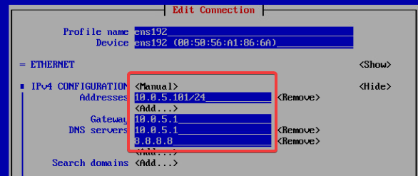
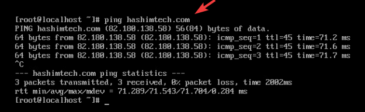
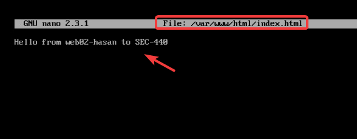

# Web02 Configurations
Before we start web02 we should chnge the network adapter to our LAN Network, as shown below:



Now start web02 and use the nmtui command to configure the network, as shown below (**DO NOT USE THESE IP ADRESS**):



Testing the netowrk by ping hashimtech.com:



Now we need to update the system, installing httpd, starting httpd, and final config the firewall:

```
sudo yum update
yum install httpd
systemctl start httpd
systemctl enable httpd.service
firewall-cmd --add-service=http --permanent
firewall-cmd --reload
```
Don't foreget to add index.html file to show in the webserver:

```
nano /var/www/html/index.html
Hello from web02-hasan to SEC-440
```


