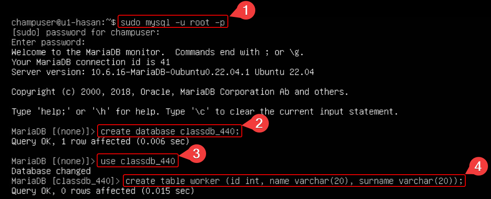

# Galera Cluster and HAProxy Configuration

## Initial Setup on All Nodes (`u1`, `u2`, `u3`)

Before starting, ensure that all nodes (`u1`, `u2`, `u3`) are prepared for the Galera Cluster setup. This involves setting the network adapter to the LAN Network, as shown below:

[inster_image_here]

## Stopping MariaDB on All Nodes

Stop the MariaDB service on all nodes to prepare for the Galera Cluster initialization.

```
sudo systemctl stop mariadb
```

Check the status to ensure MariaDB is stopped:

```
sudo systemctl status mariadb
```

[inster_image_here]

## Starting the Galera Cluster on the First Node (`u1`)

On `u1`, initialize the Galera Cluster:

```
sudo galera_new_cluster
```

Verify the cluster size:

```
mysql -u root -p -e "SHOW STATUS LIKE 'wsrep_cluster_size'"
```


## Joining the Cluster on Second (`u2`) and Third Nodes (`u3`)

On `u2` and `u3`, start MariaDB and join the cluster:

```
sudo systemctl start mariadb
```

Check the status and verify the cluster size:

```
sudo systemctl status mariadb
mysql -u root -p -e "SHOW STATUS LIKE 'wsrep_cluster_size'"
```


## Verifying Replication on the First Node (`u1`)

Create a test database and table on `u1` to verify replication:

```
mysql -u root -p
CREATE DATABASE classdb_440_440;
USE classdb_440_440;
CREATE TABLE worker (id int, name varchar(20), surname varchar(20));
INSERT INTO worker VALUES (1,"Hasan","Hashim"), (2,"Ali","Hashim");
SELECT * FROM worker;
```



## Verifying Replication on Second (`u2`) and Third Nodes (`u3`)

On `u2` and `u3`, verify that the `classdb_440` database and its contents are replicated:

```
mysql -u root -p
SHOW DATABASES;
USE classdb_440;
SELECT * FROM worker;
```


On `u2`, add a new entry:

```
INSERT INTO worker VALUES (3,"nisha","sharma");
SELECT * FROM worker;
```


On `u3`, verify the updated entries:

```
SELECT * FROM worker;
```


## Setting Up HAProxy for MySQL Load Balancing

Install and configure HAProxy on the HAProxy nodes (`ha1`, `ha2`) following the detailed steps provided in the referenced guides. This includes adjusting the HAProxy configuration file (`/etc/haproxy/haproxy.cfg`) to manage MySQL traffic and ensure high availability.

Do this on all nodes ```u1, u2, and u3```

```
mysql -u root -p; CREATE USER 'ha'@'10.0.6.10'; FLUSH PRIVILAGES;
GRANT ALL PRIVILEGES ON *.* TO 'ha_root'@'10.0.6.10' IDENTIFIED BY 'PASSWORD' WITH GRANT OPTION;flush privileges;
mysql -u root -p -e "SELECT User, Host FROM mysql.user"
```

## Final Steps

After setting up HAProxy, ensure that all nodes and the HAProxy instances are correctly configured and operational. Test the load balancing by connecting to the MySQL database through HAProxy's IP address and port.


