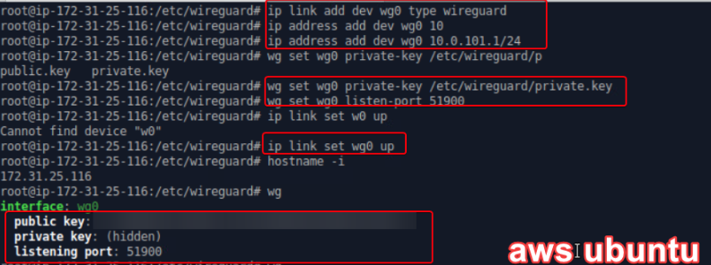
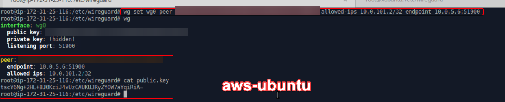
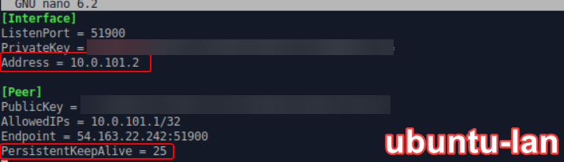
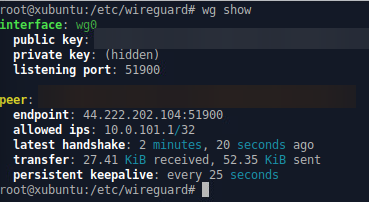

# SEC-440 Wireguard LAB 7-1

**References** 
Wireguard is an Open Source layer 3 VPN that runs over UDP. It is a minimalist VPN that has been added to the upcoming Linux 5.5 Kernel. General References

**Overview**
For this first lab,  plan to research Wireguard VPN and install it on peer systems. The goal is to secure and hide both ssh and http session traffic between between EC2 and a LAN host The reference architecture shown below will illustrate both a traditional connection between hosts as well as one through the Wireguard VPN. This lab will illustrate how wireguard can be used to secure traffic across an untrusted network.


**Objectives** The AWS system will be able to: access it's wireguard peer (xubuntu-lan) behind a nat network via ssh and icmp access your LAN web server (or pool) via http The LAN system xubuntu-lan can access HTTP on port 8080 on the AWS ubuntu peer through the Wireguard tunnel

## Setting up AWS
Go to aws login and click on EC2:


Click on Launch instance


Name your instance and select ubuntu:


Choise the AMI and instance type as hsown below:


Chose or create your key pair and security group as shown below:


when you done click on Launch instance:


wait for the instance state to be running:


to ssh to it you need to get your .pem file, username, and the public ip. As shown below: 


## Installing and configuration of WireGuard:

do the following in both system aws ubuntu and xubuntu:
update your systems and install wireguard
to do that I used the following commands:
```
sudo apt-get update 
sudo apt-get install wireguard 
```


do the folldowing on both systems: 
create the private and public keys, to learn more vist https://www.wireguard.com/quickstart/ :
```
sudo -i
cd /etc/wireguard/wireguard
wg genkey | sudo tee /etc/wireguard/private.key
sudo chmod go= /etc/wireguard/private.key
sudo cat /etc/wireguard/private.key | wg pubkey | sudo tee /etc/wireguard/public.key
```


**Wireguard Configuration**

To establish a Wireguard VPN interface on an Ubuntu system, the following steps are taken. First, the command `ip link add dev wg0 type wireguard` is executed to create a new network interface named wg0, specifying that it is of type Wireguard. Following this, the command `ip address add dev wg0 10.0.101.1/24` assigns the IP address 10.0.101.1 with a subnet mask of 24 bits to the wg0 interface. To secure the connection, `wg set wg0 private-key /etc/wireguard/private.key` is used to assign a private key to the wg0 interface, stored at /etc/wireguard/private.key. Additionally, `wg set wg0 listen-port 51900` configures wg0 to listen on port 51900 for incoming connections. The interface is then activated with `ip link set wg0 up`. 
```
ip link add dev wg0 type wireguard
ip address add dev wg0 10.0.101.1/24
wg set wg0 private-key /etc/wireguard/private.key
wg set wg0 listen-port 51900
ip link set wg0 up
```
for the xubuntu will do the same but changin the following: from `ip address add dev wg0 10.0.101.1/24` to `ip address add dev wg0 10.0.101.2/24`




*   Edit the security group in aws
    *   Custom Inbound UDP rule to allow port 51900
    *   ICMP Inbound Rule to allow (if it doesn’t exist already)


**peer connection**

To configure a peer connection in Wireguard, the `wg set wg0 peer` command is utilized, incorporating the peer's public key (replaced here with `[key]` as a placeholder for the actual key value). This setup specifies that only traffic destined for the IP address `10.0.101.2/32` is permitted through this tunnel, ensuring targeted and secure communication. The `endpoint` parameter is followed by the address `10.0.5.6` and the port `51900`, defining the external endpoint of the peer where encrypted packets should be sent. This command effectively establishes a secure and specified route for traffic between the local Wireguard interface `wg0` and the remote peer, leveraging Wireguard's capabilities for efficient and secure VPN connections.
```
wg set wg0 peer [key] allowed-ips 10.0.101.2/32 endpoint 10.0.5.6:51900
```
do the same with xubuntu:



To capture and save the current configuration of the Wireguard interface `wg0` into a configuration file, the command `wg showconf wg0 | tee /etc/wireguard/wg0.conf` is employed. This command performs two actions simultaneously. First, `wg showconf wg0` displays the running configuration of the `wg0` Wireguard interface, which includes details such as private keys, peer configurations, and any other settings that have been applied. Then, the `tee` command takes this output and writes it to the file `/etc/wireguard/wg0.conf`, effectively saving the configuration. This file can later be used to quickly restore or apply the same configuration to `wg0` or another Wireguard interface, facilitating easy management and deployment of VPN settings. The use of `tee` allows the administrator to see the configuration on the terminal while it's being saved, ensuring transparency and control over the VPN setup.
```
wg showconf wg0 | tee /etc/wireguard/wg0.conf
```


in the aws ubuntu add the following in the Interface section in the wg0.conf
Address = 10.0.101.1


in the xubuntu-lan add the following in the Interface section in the wg0.conf
Address = 10.0.101.2



run the following in the both systems:
```
wg-quick down wg0
wg-quick up wg0
wg show
```



Now you should be able to ping each other:


## Apache on aws ubuntu
to install and configure follow this steps:
https://www.digitalocean.com/community/tutorials/how-to-install-the-apache-web-server-on-ubuntu-20-04

Don't forgot to change the port from 80 to 8080 in the /etc/apache2/ports.conf


at the end you should have an index.html in the /var/www/html and working apache server in the aws ubuntu:


Now you should be able to curl using the wireguard ip or the pupblic ip:


## AWS-Ubuntu to web (forwarding)
In the /etc/wireguard/wg0.conf add the 10.0.5.0/24 ip :


add the following lines in both systems, in there wg0.conf file:

in aws ubuntu
```
PostUp = iptables -A FORWARD -i %i -j ACCEPT; iptables -A FORWARD -o %i -j ACCEPT; iptables -t nat -A POSTROUTING -o eth0 -j MASQUERADE 
PostDown = iptables -D FORWARD -i %i -j ACCEPT; iptables -D FORWARD -o %i -j ACCEPT; iptables -t nat -D POSTROUTING -o eth0 -j MASQUERADE 
```
on xubuntu:
```
PostUp = iptables -A FORWARD -i %i -j ACCEPT; iptables -A FORWARD -o %i -j ACCEPT; iptables -t nat -A POSTROUTING -o ens160 -j MASQUERADE 
PostDown = iptables -D FORWARD -i %i -j ACCEPT; iptables -D FORWARD -o %i -j ACCEPT; iptables -t nat -D POSTROUTING -o ens160 -j MASQUERADE 
```


Now on both system run these commands to turn on the forwarding:
```
sysctl -w net.ipv4.ip_forward=1 
sysctl -p

wg-quick down wg0
wg-quick up wg0
```
To test it now we need to run the curl command on aws to see it we are able to connect to system in web:
on aws ubuntu
```
curl 10.0.5.100
```


## Reflection
Working on Wireguard VPN lab offered a comprehensive and practical understanding of setting up a secure VPN tunnel between AWS and a LAN host, demonstrating the power of Wireguard's simplicity and efficiency. This lab not only enhanced my skills in configuring VPNs but also deepened my appreciation for the importance of securing network traffic, especially in untrusted environments. I had some isuues with setting up the iptable it took me while to get it done. 